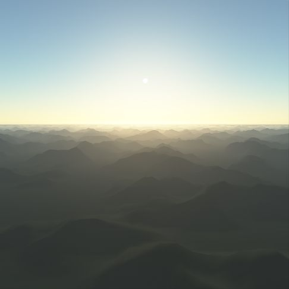

# Brunetons-Atmospheric-Scatter

This is a port of Eric Brunetons precomputed atmospheric scattering [project](http://www-evasion.imag.fr/Membres/Eric.Bruneton/) into Unity. Single scatter is quite easy to compute but most of the interesting atmospheric effects come from multiple scattering. The idea is that the effects from multiple scattering can be precomputed and stored as a lookup table.

The inscatter table is unfortunately 4 dimensional. This means it must be stored in a 3D texture which makes sampling from it a little tricky but it is possible. I have also included the code to create the tables. There's also a transmittance and a irradiance table but these are only 2D so can be stored in a normal texture. The irradiance one is not actually used for this project. These tables are stored as raw files. Unity wont include these in the build so you will have to manually place them in the build or change them to a supported file format like exr.

The code to make the tables was found in the [Proland](https://proland.inrialpes.fr/) project by the same author. This is all done on the GPU using shaders. The process is very complicated and was rather difficult to port from OpenGL to Direct Compute and produce the same effect. I have got my code to reproduce the tables very closely but they are not quite the same. Mine are off slightly less intensity and there is a pixel offset issue at the horizon. Never did work out the cause of those issues but it still works fine.

 
This project contains three scenes. One is just the atmospheric scattering on a sky dome. The other one will create the tables when run. The third one applies the scattering as a post effect so all objects in the scene will automatically have the effect applied to them with no changes required to their materials.

The post effect is something I have added and works quite well but more work would be needed to be practical. There is a issue with how to blend between the sky which needs to be handled differently (it has the scatter applied in its material, not the post effect) and everything else in the scene.  I have just presumed where the depth buffer is one it has not been written to so must be the sky. This mostly works but you will end up will artifacts due to precision issues.

There is a newer improved version of this project [here](https://github.com/Scrawk/Brunetons-Improved-Atmospheric-Scattering).

